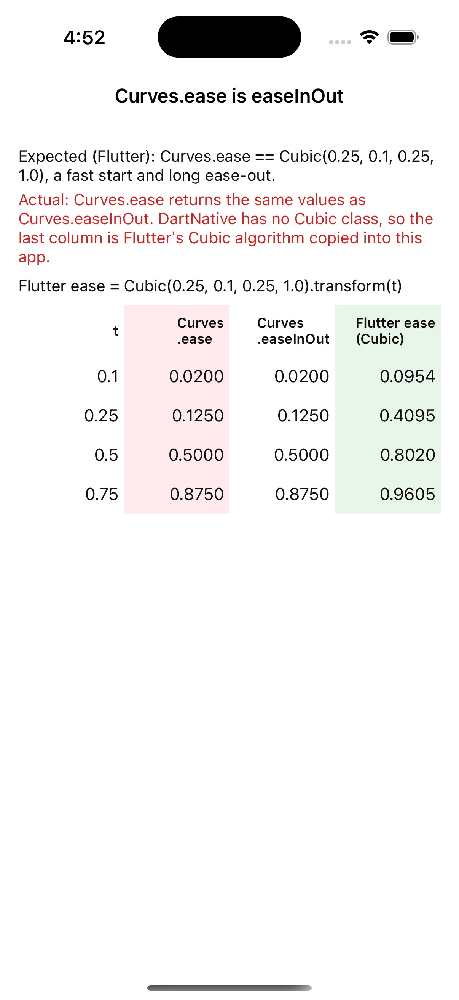

# Repro: `Curves.ease` is `easeInOut`, not Flutter's `ease`

In DartNative 1.0.0 `Curves.ease` exists but is the same curve as `Curves.easeInOut`; its doc comment says the ease-in-out curve "stands in for Flutter's slightly different cubic". Flutter's `Curves.ease` is `Cubic(0.25, 0.1, 0.25, 1.0)` (CSS `ease`): a quick start and a long ease-out. Code ported from Flutter compiles but animates differently, slower off the mark, and there is no `Cubic` class to define the real curve.

## Run

`dn run` (iOS simulator; Android behaves the same unless stated).

## What you'll see

A table of `transform(t)` for t = 0.1, 0.25, 0.5, 0.75:

- `Curves.ease` (DartNative)
- `Curves.easeInOut` (DartNative)
- Flutter's `ease`, `Cubic(0.25, 0.1, 0.25, 1.0)`. DartNative has no `Cubic`, so the app carries a copy of Flutter's `Cubic.transform` (same bisection and error bound) to compute it.

The first two columns are identical; the third differs.

## Expected

As in Flutter: `Curves.ease.transform(t)` equals `Cubic(0.25, 0.1, 0.25, 1.0).transform(t)` (about 0.41 at t = 0.25 and 0.80 at t = 0.5).

## Recording

## Environment

- DartNative 1.0.0 (SDK `113c27aacb2`, framework edition `7ae29132`), Dart 3.12.0
- macOS 26.7.1, Xcode 26.1.1
- iPhone 17 simulator, iOS 26.1
